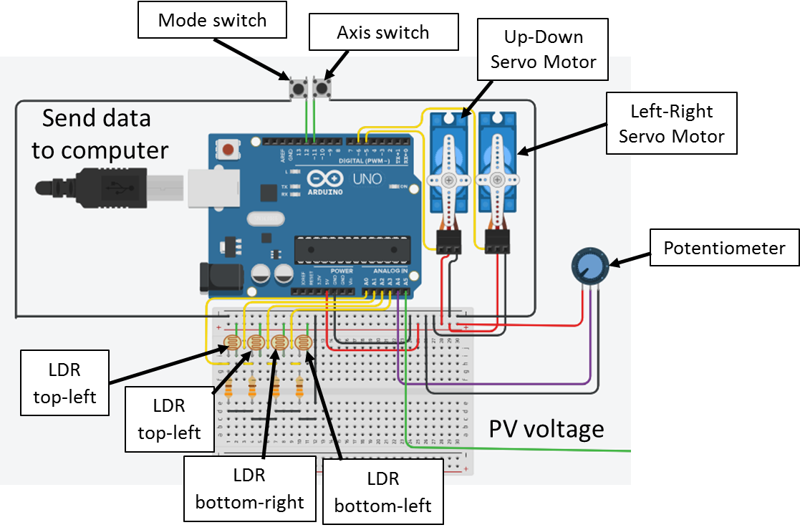

# Automated Solar Positioning System using Arduino and LDR

## Overview
This project implements an **automated solar tracking system** designed to optimize the orientation of a solar panel for maximum sunlight exposure.  
The system uses **Light Dependent Resistors (LDRs)** to detect light intensity and an **Arduino microcontroller** to control servo motors that adjust the panel’s position.

## Objectives
- Maintain optimal alignment of the solar panel with the sun throughout the day.  
- Improve energy capture efficiency through automated tracking.  
- Provide a cost‑effective and replicable design for educational and research purposes.

## System Description
The system operates by continuously comparing light intensity readings from two LDR sensors positioned on opposite sides of the panel.  
When a significant difference is detected, the Arduino adjusts the servo motor to re‑align the panel toward the brighter direction.  
A tolerance threshold is implemented to prevent unnecessary servo movement due to minor fluctuations in light.

## Hardware Components
- Arduino Uno (or compatible board)  
- 2 × Light Dependent Resistors (LDRs)  
- 1 × Servo motor (horizontal axis control)  
- Resistors for voltage dividers  
- Breadboard and jumper wires  
- Solar panel (for demonstration)  
- Mounting frame for panel and sensors

## Software
- **Language:** C++ (Arduino IDE)  
- **Libraries:** `Servo.h`  
- **Functionality:**  
  - Reads analog input from LDRs.  
  - Compares readings and determines adjustment direction.  
  - Sends control signals to servo motor.  
  - Implements positional limits and tolerance control.

## System Block Diagram

## Setup and Usage
1. Assemble the hardware according to the wiring diagram.  
2. Connect the Arduino to your computer.  
3. Open the `.ino` file in Arduino IDE.  
4. Upload the code to the Arduino board.  
5. Power the system and observe automatic panel alignment.

## Potential Enhancements
- Dual‑axis tracking for improved precision.  
- Integration of a real‑time clock (RTC) for night reset positioning.  
- Data logging for performance analysis.  
- Weatherproofing for outdoor deployment.

## License
This project is released under the MIT License. See the LICENSE file for details.
